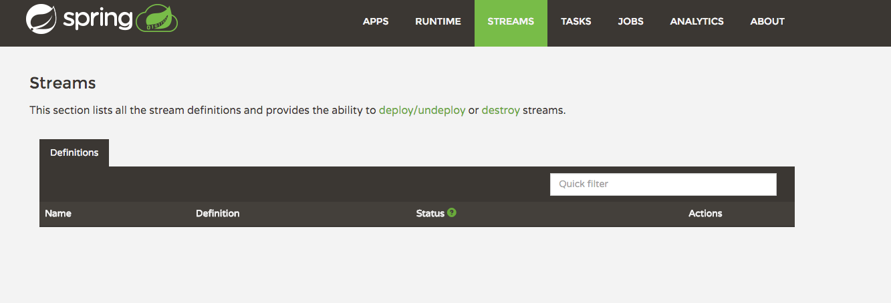

# Spring Cloud Data Flow Demo

This is a simple demo to explore Spring Cloud Data Flow working on Cloud Foundry to provide an experience similar to Spring XD.

## Overview

Spring Cloud Data Flow provides an abstration for the following Spring projects to stream data from sources to sinks (while providing filtering and processing in between).

- Spring Data
- Spring Integration
- Spring Batch

This can be done with minimal knowledge of these projects opening the door for none Java developers to create flows.

An example stream might be:

FTP -> Transform Objects to JSON -> Filter on 'country=CA' -> HDFS

This stream would poll a FTP for files. Each row of a file would be converted to JSON. Only JSON where the attribute country was equal to 'CA' would then be written down to HDFS.

Using Spring Cloud Data Flow each step in this stream would become a application orchestrated by Pivotal Cloud Foundry.

### Setting Up The Server In PCF

The following steps need to be completed to get the server set up to submit Spring XD jobs.

1. Download the Spring Cloud Server project
2. Download the Spring Cloud Shell project
3. Create a Redis Service in PCF
4. Create a Rabbit Service in PCF
5. Push the Server project into PCF
6. Set up environmental variables for the Server to integrate with the elastic runtime of PCF
7. Start the Server

Running demo_setup_1.sh will perform all the steps on PWS (run.pivotal.io). The script needs the organization, space, username and password with permissions to create new applications.

```shell
./demo_setup_1.sh 'My Org' 'luke' 'email@mydomain.com' 'mypassword'
```
Upon successful completetion of the script, the application will then be viewed and managed from the app console


The admin-ui will provide information about the Streams running and other useful details about the state of the Spring Cloud Data Flow Server (http://luke-dataflow-server.cfapps.io/admin-ui/index.html)



### Connecting To The Running Server

Next step is too connect the local CLI to the running server to create the famous TickTock stream. To do this start the CLI application locally and use the `dataflow config server` command to connect to the server.

Next we perform the following steps:

1. Register the time source
2. Register the log sink
3. Create the stream

To connect to the server running on PCF

```shell
➜  spring-cloud-data-flow-demo git:(master) ✗ java -jar spring-cloud-dataflow-shell-1.0.0.BUILD-SNAPSHOT.jar
  ____                              ____ _                __
 / ___| _ __  _ __(_)_ __   __ _   / ___| | ___  _   _  __| |
 \___ \| '_ \| '__| | '_ \ / _` | | |   | |/ _ \| | | |/ _` |
  ___) | |_) | |  | | | | | (_| | | |___| | (_) | |_| | (_| |
 |____/| .__/|_|  |_|_| |_|\__, |  \____|_|\___/ \__,_|\__,_|
  ____ |_|    _          __|___/                 __________
 |  _ \  __ _| |_ __ _  |  ___| | _____      __  \ \ \ \ \ \
 | | | |/ _` | __/ _` | | |_  | |/ _ \ \ /\ / /   \ \ \ \ \ \
 | |_| | (_| | || (_| | |  _| | | (_) \ V  V /    / / / / / /
 |____/ \__,_|\__\__,_| |_|   |_|\___/ \_/\_/    /_/_/_/_/_/

1.0.0.BUILD-SNAPSHOT

Welcome to the Spring Cloud Data Flow shell. For assistance hit TAB or type "help".
server-unknown:>dataflow config server http://luke-dataflow-server.cfapps.io/
Successfully targeted http://luke-dataflow-server.cfapps.io/
dataflow:>

```

To list the streams

```shell
dataflow:>stream list
╔═══════════╤═════════════════╤══════╗
║Stream Name│Stream Definition│Status║
╚═══════════╧═════════════════╧══════╝

dataflow:>
```
To see the modules

```shell
dataflow:>module list
╔══════╤═════════╤════╤════╗
║source│processor│sink│task║
╠══════╪═════════╪════╪════╣
║time  │         │log │    ║
╚══════╧═════════╧════╧════╝

dataflow:>

```
To register modules, for example time and log, run the following commands in the shell (after connecting to the server).

```shell
module register --name time --type source --uri maven://org.springframework.cloud.stream.module:time-source:jar:exec:1.0.0.BUILD-SNAPSHOT
module register --name log --type sink --uri maven://org.springframework.cloud.stream.module:log-sink:jar:exec:1.0.0.BUILD-SNAPSHOT
```
To register the famous TickTock stream as an example, run the following

```shell
dataflow:>stream create luketicktock --definition "time | log" --deploy
Created and deployed new stream 'ticktock'
dataflow:>

```

The stream can now be seen in the UI


In the apps console we can see a microservice (Spring Boot) for each task in the stream.


We can now see the result of the stream showing up in the Log microservice


New streams can be created using the admin-ui.


Only the sources and sinks that are registered with the server will show up in the palette. Some details for registering some of the existing modules

```shell

source.file=maven://org.springframework.cloud.stream.module:file-source:jar:exec:1.0.0.BUILD-SNAPSHOT
source.ftp=maven://org.springframework.cloud.stream.module:ftp-source:jar:exec:1.0.0.BUILD-SNAPSHOT
source.jdbc=maven://org.springframework.cloud.stream.module:jdbc-source:jar:exec:1.0.0.BUILD-SNAPSHOT
source.jms=maven://org.springframework.cloud.stream.module:jms-source:jar:exec:1.0.0.BUILD-SNAPSHOT
source.http=maven://org.springframework.cloud.stream.module:http-source:jar:exec:1.0.0.BUILD-SNAPSHOT
source.load-generator=maven://org.springframework.cloud.stream.module:load-generator-source:jar:exec:1.0.0.BUILD-SNAPSHOT
source.rabbit=maven://org.springframework.cloud.stream.module:rabbit-source:jar:exec:1.0.0.BUILD-SNAPSHOT
source.sftp=maven://org.springframework.cloud.stream.module:sftp-source:jar:exec:1.0.0.BUILD-SNAPSHOT
source.tcp=maven://org.springframework.cloud.stream.module:tcp-source:jar:exec:1.0.0.BUILD-SNAPSHOT
source.time=maven://org.springframework.cloud.stream.module:time-source:jar:exec:1.0.0.BUILD-SNAPSHOT
source.trigger=maven://org.springframework.cloud.stream.module:trigger-source:jar:exec:1.0.0.BUILD-SNAPSHOT
source.twitterstream=maven://org.springframework.cloud.stream.module:twitterstream-source:jar:exec:1.0.0.BUILD-SNAPSHOT
processor.bridge=maven://org.springframework.cloud.stream.module:bridge-processor:jar:exec:1.0.0.BUILD-SNAPSHOT
processor.filter=maven://org.springframework.cloud.stream.module:filter-processor:jar:exec:1.0.0.BUILD-SNAPSHOT
processor.groovy-filter=maven://org.springframework.cloud.stream.module:groovy-filter-processor:jar:exec:1.0.0.BUILD-SNAPSHOT
processor.groovy-transform=maven://org.springframework.cloud.stream.module:groovy-transform-processor:jar:exec:1.0.0.BUILD-SNAPSHOT
processor.httpclient=maven://org.springframework.cloud.stream.module:httpclient-processor:jar:exec:1.0.0.BUILD-SNAPSHOT
processor.pmml=maven://org.springframework.cloud.stream.module:pmml-processor:jar:exec:1.0.0.BUILD-SNAPSHOT
processor.splitter=maven://org.springframework.cloud.stream.module:splitter-processor:jar:exec:1.0.0.BUILD-SNAPSHOT
processor.transform=maven://org.springframework.cloud.stream.module:transform-processor:jar:exec:1.0.0.BUILD-SNAPSHOT
sink.aggregate-counter=maven://org.springframework.cloud.stream.module:aggregate-counter-sink:jar:exec:1.0.0.BUILD-SNAPSHOT
sink.cassandra=maven://org.springframework.cloud.stream.module:cassandra-sink:jar:exec:1.0.0.BUILD-SNAPSHOT
sink.counter=maven://org.springframework.cloud.stream.module:counter-sink:jar:exec:1.0.0.BUILD-SNAPSHOT
sink.field-value-counter=maven://org.springframework.cloud.stream.module:field-value-counter-sink:jar:exec:1.0.0.BUILD-SNAPSHOT
sink.file=maven://org.springframework.cloud.stream.module:file-sink:jar:exec:1.0.0.BUILD-SNAPSHOT
sink.ftp=maven://org.springframework.cloud.stream.module:ftp-sink:jar:exec:1.0.0.BUILD-SNAPSHOT
sink.gemfire=maven://org.springframework.cloud.stream.module:gemfire-sink:jar:exec:1.0.0.BUILD-SNAPSHOT
sink.gpfdist=maven://org.springframework.cloud.stream.module:gpfdist-sink:jar:exec:1.0.0.BUILD-SNAPSHOT
sink.hdfs=maven://org.springframework.cloud.stream.module:hdfs-sink:jar:exec:1.0.0.BUILD-SNAPSHOT
sink.jdbc=maven://org.springframework.cloud.stream.module:jdbc-sink:jar:exec:1.0.0.BUILD-SNAPSHOT
sink.log=maven://org.springframework.cloud.stream.module:log-sink:jar:exec:1.0.0.BUILD-SNAPSHOT
sink.rabbit=maven://org.springframework.cloud.stream.module:rabbit-sink:jar:exec:1.0.0.BUILD-SNAPSHOT
sink.redis=maven://org.springframework.cloud.stream.module:redis-sink:jar:exec:1.0.0.BUILD-SNAPSHOT
sink.router=maven://org.springframework.cloud.stream.module:router-sink:jar:exec:1.0.0.BUILD-SNAPSHOT
sink.tcp=maven://org.springframework.cloud.stream.module:tcp-sink:jar:exec:1.0.0.BUILD-SNAPSHOT
sink.throughput=maven://org.springframework.cloud.stream.module:throughput-sink:jar:exec:1.0.0.BUILD-SNAPSHOT
sink.websocket=maven://org.springframework.cloud.stream.module:websocket-sink:jar:exec:1.0.0.BUILD-SNAPSHOT
task.timestamp=maven://org.springframework.cloud.task.module:timestamp-task:jar:exec:1.0.0.BUILD-SNAPSHOT
```

# References

http://cloud.spring.io/spring-cloud-dataflow/

https://github.com/spring-projects/spring-integration-java-dsl/wiki/spring-integration-java-dsl-reference
