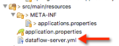
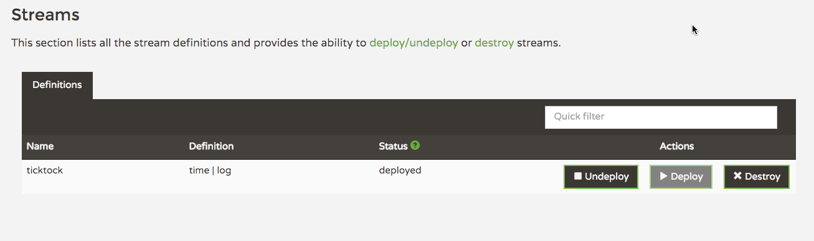
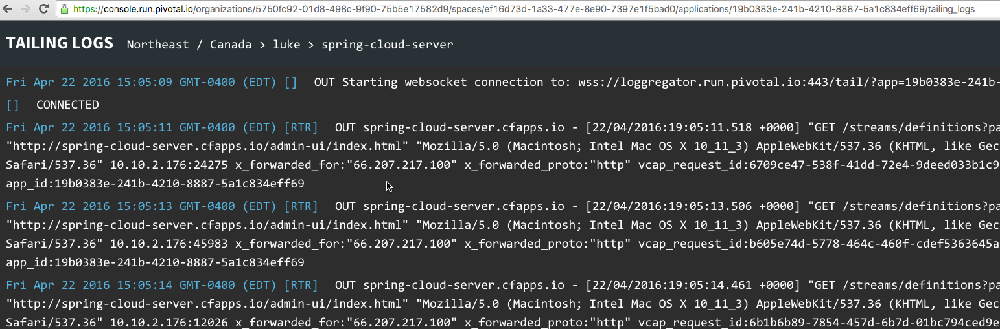

# Spring Cloud Data Flow Demo

_NOTE_
Work on this sample is paused until the M3 release of Spring Cloud Data flow happens next week.

This is a simple set of examples to explore Spring Cloud Data Flow. This is coming from the perspective of someone who has worked with Spring XD and looking to get familiar with Spring Cloud Data Flow.

## Server and DSL Example

As with Spring XD we can leverage the DSL. Using the DSL it was easy to create flows that resulting in data moving from a source to a sink by taking advantage of:

- Spring Data
- Spring Integration
- Spring Batch

This can be done with minimal knowledge of these projects opening the door for none Java developers to create flows.

## Requirements

- A basical understanding of what Spring XD is and its DSL is required to fully appreciate what is being done in this example.

- Redis is required to run the server. There is a version of Redis in the Spring Cloud Data Flow project, or if an a Mac it can be installed using Brew. http://jasdeep.ca/2012/05/installing-redis-on-mac-os-x/
- 
## Caveats
These examples were built prior to a GA release of the project. As a result their are manual steps taken when working with a http://start.spring.io/ generated project that will most likely not be required to be taken after the project is GA.

## Starting Redis Locally

```shell

➜  SpringCloudServer git:(master) ✗ redis-server
80560:C 21 Apr 17:36:35.261 # Warning: no config file specified, using the default config. In order to specify a config file use redis-server /path/to/redis.conf
80560:M 21 Apr 17:36:35.262 * Increased maximum number of open files to 10032 (it was originally set to 256).
                _._                                                  
           _.-``__ ''-._                                             
      _.-``    `.  `_.  ''-._           Redis 3.0.7 (00000000/0) 64 bit
  .-`` .-```.  ```\/    _.,_ ''-._                                   
 (    '      ,       .-`  | `,    )     Running in standalone mode
 |`-._`-...-` __...-.``-._|'` _.-'|     Port: 6379
 |    `-._   `._    /     _.-'    |     PID: 80560
  `-._    `-._  `-./  _.-'    _.-'                                   
 |`-._`-._    `-.__.-'    _.-'_.-'|                                  
 |    `-._`-._        _.-'_.-'    |           http://redis.io        
  `-._    `-._`-.__.-'_.-'    _.-'                                   
 |`-._`-._    `-.__.-'    _.-'_.-'|                                  
 |    `-._`-._        _.-'_.-'    |                                  
  `-._    `-._`-.__.-'_.-'    _.-'                                   
      `-._    `-.__.-'    _.-'                                       
          `-._        _.-'                                           
              `-.__.-'                                               

80560:M 21 Apr 17:36:35.263 # Server started, Redis version 3.0.7
80560:M 21 Apr 17:36:35.263 * The server is now ready to accept connections on port 6379

```
## Creating a server project

start.spring.io is used to create the project. The dependancies selected can be seen here: https://github.com/lshannon/spring-cloud-data-flow-demo/blob/master/SpringCloudServer/pom.xml. Some of these where manually added to get the project to compile. Once the project is GA the pom will contain everything required without modification.

### Configuration

The file META-INF/applications.properties is required.

start.spring.io did not create this file at the time this example was created. This file needs to be manually created, and then the following entries added to it:

```java

source.file=maven://org.springframework.cloud.stream.module:file-source:jar:exec:1.0.0.BUILD-SNAPSHOT
source.ftp=maven://org.springframework.cloud.stream.module:ftp-source:jar:exec:1.0.0.BUILD-SNAPSHOT
source.jdbc=maven://org.springframework.cloud.stream.module:jdbc-source:jar:exec:1.0.0.BUILD-SNAPSHOT
source.jms=maven://org.springframework.cloud.stream.module:jms-source:jar:exec:1.0.0.BUILD-SNAPSHOT
source.http=maven://org.springframework.cloud.stream.module:http-source:jar:exec:1.0.0.BUILD-SNAPSHOT
source.load-generator=maven://org.springframework.cloud.stream.module:load-generator-source:jar:exec:1.0.0.BUILD-SNAPSHOT
source.rabbit=maven://org.springframework.cloud.stream.module:rabbit-source:jar:exec:1.0.0.BUILD-SNAPSHOT
source.sftp=maven://org.springframework.cloud.stream.module:sftp-source:jar:exec:1.0.0.BUILD-SNAPSHOT
source.tcp=maven://org.springframework.cloud.stream.module:tcp-source:jar:exec:1.0.0.BUILD-SNAPSHOT
source.time=maven://org.springframework.cloud.stream.module:time-source:jar:exec:1.0.0.BUILD-SNAPSHOT
source.trigger=maven://org.springframework.cloud.stream.module:trigger-source:jar:exec:1.0.0.BUILD-SNAPSHOT
source.twitterstream=maven://org.springframework.cloud.stream.module:twitterstream-source:jar:exec:1.0.0.BUILD-SNAPSHOT
processor.bridge=maven://org.springframework.cloud.stream.module:bridge-processor:jar:exec:1.0.0.BUILD-SNAPSHOT
processor.filter=maven://org.springframework.cloud.stream.module:filter-processor:jar:exec:1.0.0.BUILD-SNAPSHOT
processor.groovy-filter=maven://org.springframework.cloud.stream.module:groovy-filter-processor:jar:exec:1.0.0.BUILD-SNAPSHOT
processor.groovy-transform=maven://org.springframework.cloud.stream.module:groovy-transform-processor:jar:exec:1.0.0.BUILD-SNAPSHOT
processor.httpclient=maven://org.springframework.cloud.stream.module:httpclient-processor:jar:exec:1.0.0.BUILD-SNAPSHOT
processor.pmml=maven://org.springframework.cloud.stream.module:pmml-processor:jar:exec:1.0.0.BUILD-SNAPSHOT
processor.splitter=maven://org.springframework.cloud.stream.module:splitter-processor:jar:exec:1.0.0.BUILD-SNAPSHOT
processor.transform=maven://org.springframework.cloud.stream.module:transform-processor:jar:exec:1.0.0.BUILD-SNAPSHOT
sink.aggregate-counter=maven://org.springframework.cloud.stream.module:aggregate-counter-sink:jar:exec:1.0.0.BUILD-SNAPSHOT
sink.cassandra=maven://org.springframework.cloud.stream.module:cassandra-sink:jar:exec:1.0.0.BUILD-SNAPSHOT
sink.counter=maven://org.springframework.cloud.stream.module:counter-sink:jar:exec:1.0.0.BUILD-SNAPSHOT
sink.field-value-counter=maven://org.springframework.cloud.stream.module:field-value-counter-sink:jar:exec:1.0.0.BUILD-SNAPSHOT
sink.file=maven://org.springframework.cloud.stream.module:file-sink:jar:exec:1.0.0.BUILD-SNAPSHOT
sink.ftp=maven://org.springframework.cloud.stream.module:ftp-sink:jar:exec:1.0.0.BUILD-SNAPSHOT
sink.gemfire=maven://org.springframework.cloud.stream.module:gemfire-sink:jar:exec:1.0.0.BUILD-SNAPSHOT
sink.gpfdist=maven://org.springframework.cloud.stream.module:gpfdist-sink:jar:exec:1.0.0.BUILD-SNAPSHOT
sink.hdfs=maven://org.springframework.cloud.stream.module:hdfs-sink:jar:exec:1.0.0.BUILD-SNAPSHOT
sink.jdbc=maven://org.springframework.cloud.stream.module:jdbc-sink:jar:exec:1.0.0.BUILD-SNAPSHOT
sink.log=maven://org.springframework.cloud.stream.module:log-sink:jar:exec:1.0.0.BUILD-SNAPSHOT
sink.rabbit=maven://org.springframework.cloud.stream.module:rabbit-sink:jar:exec:1.0.0.BUILD-SNAPSHOT
sink.redis=maven://org.springframework.cloud.stream.module:redis-sink:jar:exec:1.0.0.BUILD-SNAPSHOT
sink.router=maven://org.springframework.cloud.stream.module:router-sink:jar:exec:1.0.0.BUILD-SNAPSHOT
sink.tcp=maven://org.springframework.cloud.stream.module:tcp-sink:jar:exec:1.0.0.BUILD-SNAPSHOT
sink.throughput=maven://org.springframework.cloud.stream.module:throughput-sink:jar:exec:1.0.0.BUILD-SNAPSHOT
sink.websocket=maven://org.springframework.cloud.stream.module:websocket-sink:jar:exec:1.0.0.BUILD-SNAPSHOT
task.timestamp=maven://org.springframework.cloud.task.module:timestamp-task:jar:exec:1.0.0.BUILD-SNAPSHOT

```

Also create a resources/dataflow-server.yml file to configure the server.



The values for this file can be taken from here:
https://github.com/spring-cloud/spring-cloud-dataflow/blob/master/spring-cloud-starter-dataflow-server-local/src/main/resources/dataflow-server.yml

## Start the Server project

```shell

/ ___| _ __  _ __(_)_ __   __ _   / ___| | ___  _   _  __| |
 \___ \| '_ \| '__| | '_ \ / _` | | |   | |/ _ \| | | |/ _` |
  ___) | |_) | |  | | | | | (_| | | |___| | (_) | |_| | (_| |
 |____/| .__/|_|  |_|_| |_|\__, |  \____|_|\___/ \__,_|\__,_|
  ____ |_|    _          __|___/                 __________
 |  _ \  __ _| |_ __ _  |  ___| | _____      __  \ \ \ \ \ \
 | | | |/ _` | __/ _` | | |_  | |/ _ \ \ /\ / /   \ \ \ \ \ \
 | |_| | (_| | || (_| | |  _| | | (_) \ V  V /    / / / / / /
 |____/ \__,_|\__\__,_| |_|   |_|\___/ \_/\_/    /_/_/_/_/_/

 1.0.0.BUILD-SNAPSHOT

2016-04-21 17:39:44.695  INFO 80595 --- [           main] c.c.c.ConfigServicePropertySourceLocator : Fetching config from server at: http://localhost:8888
2016-04-21 17:39:44.816  WARN 80595 --- [           main] c.c.c.ConfigServicePropertySourceLocator : Could not locate PropertySource: I/O error on GET request for "http://localhost:8888/spring-cloud-dataflow-server-local/default": Connection refused; nested exception is java.net.ConnectException: Connection refused
2016-04-21 17:39:44.817  INFO 80595 --- [           main] c.l.s.SpringCloudServerApplication       : No active profile set, falling back to default profiles: default
2016-04-21 17:39:44.827  INFO 80595 --- [           main] ationConfigEmbeddedWebApplicationContext : Refreshing org.springframework.boot.context.embedded.AnnotationConfigEmbeddedWebApplicationContext@69bc62e9: startup date [Thu Apr 21 17:39:44 EDT 2016]; parent: org.springframework.context.annotation.AnnotationConfigApplicationContext@58ef44f5

....Output trimmed for brevity....

2016-04-21 17:39:51.251  INFO 80595 --- [           main] o.s.i.monitor.IntegrationMBeanExporter   : Registering MessageChannel errorChannel
2016-04-21 17:39:51.252  INFO 80595 --- [           main] o.s.i.monitor.IntegrationMBeanExporter   : Located managed bean 'org.springframework.integration:type=MessageChannel,name=errorChannel': registering with JMX server as MBean [org.springframework.integration:type=MessageChannel,name=errorChannel]
2016-04-21 17:39:51.293  INFO 80595 --- [           main] o.s.i.monitor.IntegrationMBeanExporter   : Located managed bean 'org.springframework.integration:type=MessageHandler,name=errorLogger,bean=internal': registering with JMX server as MBean [org.springframework.integration:type=MessageHandler,name=errorLogger,bean=internal]
2016-04-21 17:39:51.450  INFO 80595 --- [           main] o.s.c.support.DefaultLifecycleProcessor  : Starting beans in phase 0
2016-04-21 17:39:51.470  INFO 80595 --- [           main] o.s.i.endpoint.EventDrivenConsumer       : Adding {logging-channel-adapter:_org.springframework.integration.errorLogger} as a subscriber to the 'errorChannel' channel
2016-04-21 17:39:51.471  INFO 80595 --- [           main] o.s.i.channel.PublishSubscribeChannel    : Channel 'spring-cloud-dataflow-server-local:9393.errorChannel' has 1 subscriber(s).
2016-04-21 17:39:51.471  INFO 80595 --- [           main] o.s.i.endpoint.EventDrivenConsumer       : started _org.springframework.integration.errorLogger
2016-04-21 17:39:51.549  INFO 80595 --- [           main] s.b.c.e.t.TomcatEmbeddedServletContainer : Tomcat started on port(s): 9393 (http)
2016-04-21 17:39:51.553  INFO 80595 --- [           main] c.l.s.SpringCloudServerApplication       : Started SpringCloudServerApplication in 7.921 seconds (JVM running for 8.421)

```

After the server is started, the server UI can now be seen in on the port specified in the Yml file.


## Create the CLI project
Like the Server project, start.spring.io is used. The dependancies selected can be seen in the pom file: https://github.com/lshannon/spring-cloud-data-flow-demo/blob/master/SpringCloudCLI/pom.xml

## Start the CLI

Upon starting it will try and connected to a locally running server.

```shell

➜  SpringCloudCLI git:(master) ✗ java -jar target/SpringCloudCLI.jar   
  ____                              ____ _                __
 / ___| _ __  _ __(_)_ __   __ _   / ___| | ___  _   _  __| |
 \___ \| '_ \| '__| | '_ \ / _` | | |   | |/ _ \| | | |/ _` |
  ___) | |_) | |  | | | | | (_| | | |___| | (_) | |_| | (_| |
 |____/| .__/|_|  |_|_| |_|\__, |  \____|_|\___/ \__,_|\__,_|
  ____ |_|    _          __|___/                 __________
 |  _ \  __ _| |_ __ _  |  ___| | _____      __  \ \ \ \ \ \
 | | | |/ _` | __/ _` | | |_  | |/ _ \ \ /\ / /   \ \ \ \ \ \
 | |_| | (_| | || (_| | |  _| | | (_) \ V  V /    / / / / / /
 |____/ \__,_|\__\__,_| |_|   |_|\___/ \_/\_/    /_/_/_/_/_/

1.0.0.BUILD-SNAPSHOT

Welcome to the Spring Cloud Data Flow shell. For assistance hit TAB or type "help".
dataflow:>

```

The modules specified in the applications file can be seen (these are the ones registered in the applications.properties file).

```shell

dataflow:>module list
╔══════════════╤════════════════╤═══════════════════╤═════════╗
║    source    │   processor    │       sink        │  task   ║
╠══════════════╪════════════════╪═══════════════════╪═════════╣
║file          │bridge          │aggregate-counter  │timestamp║
║ftp           │filter          │cassandra          │         ║
║http          │groovy-filter   │counter            │         ║
║jdbc          │groovy-transform│custom-log         │         ║
║jms           │httpclient      │field-value-counter│         ║
║load-generator│pmml            │file               │         ║
║rabbit        │splitter        │ftp                │         ║
║sftp          │transform       │gemfire            │         ║
║tcp           │                │gpfdist            │         ║
║time          │                │hdfs               │         ║
║trigger       │                │jdbc               │         ║
║twitterstream │                │log                │         ║
║              │                │rabbit             │         ║
║              │                │redis              │         ║
║              │                │router             │         ║
║              │                │tcp                │         ║
║              │                │throughput         │         ║
║              │                │websocket          │         ║
╚══════════════╧════════════════╧═══════════════════╧═════════╝


```

## Create Good Ol TickTock

It would not be a Spring XD demo if Ticktock was not done. In the shell create the following stream.

```shell

dataflow:>stream create ticktock --definition "time | log" --deploy
Created and deployed new stream 'ticktock'
dataflow:>

```

The deployed stream can be seen in the admin console:



## Running the example on PCF

To run this simple example on PCF the first step is to get the Service pushing up and running. To do this a Redis service needs to be created in the target Space. This can be created using the UI or the CLI.


### Pushing The Server

The is already a manifest.yml file in place, so a `cf push` from the same directory will push the application up to PCF.

```shell
➜  SpringCloudServer git:(master) ✗ cf push
Using manifest file /Users/lshannon/Documents/spring-cloud-data-flow-demo/SpringCloudServer/manifest.yml

Updating app spring-cloud-server in org Northeast / Canada / space luke as lshannon@pivotal.io...
OK

Using route spring-cloud-server.cfapps.io
Uploading spring-cloud-server...
Uploading app files from: /Users/lshannon/Documents/spring-cloud-data-flow-demo/SpringCloudServer/target/SpringCloudServer.jar
Uploading 1.8M, 142 files
Done uploading               
OK
Binding service redis-service to app spring-cloud-server in org Northeast / Canada / space luke as lshannon@pivotal.io...
OK

Stopping app spring-cloud-server in org Northeast / Canada / space luke as lshannon@pivotal.io...
OK

Starting app spring-cloud-server in org Northeast / Canada / space luke as lshannon@pivotal.io...
Downloading java_buildpack...
Downloaded java_buildpack
Creating container
Successfully created container
Downloading app package...
Downloaded app package (47.6M)
Downloading build artifacts cache...
Downloaded build artifacts cache (109B)
Staging...
-----> Java Buildpack Version: v3.7 (offline) | https://github.com/cloudfoundry/java-buildpack.git#b07524d
-----> Downloading Open Jdk JRE 1.8.0_91 from https://download.run.pivotal.io/openjdk/trusty/x86_64/openjdk-1.8.0_91.tar.gz (found in cache)
       Expanding Open Jdk JRE to .java-buildpack/open_jdk_jre (1.1s)
-----> Downloading Open JDK Like Memory Calculator 2.0.2_RELEASE from https://download.run.pivotal.io/memory-calculator/trusty/x86_64/memory-calculator-2.0.2_RELEASE.tar.gz (found in cache)
       Memory Settings: -XX:MaxMetaspaceSize=64M -Xss995K -Xms382293K -XX:MetaspaceSize=64M -Xmx382293K
-----> Downloading Spring Auto Reconfiguration 1.10.0_RELEASE from https://download.run.pivotal.io/auto-reconfiguration/auto-reconfiguration-1.10.0_RELEASE.jar (found in cache)
Exit status 0
Staging complete
Uploading droplet, build artifacts cache...
Uploading build artifacts cache...
Uploading droplet...
Uploaded build artifacts cache (109B)
Uploaded droplet (93.1M)
Uploading complete

0 of 1 instances running, 1 starting
0 of 1 instances running, 1 starting
0 of 1 instances running, 1 starting
1 of 1 instances running

App started


OK

App spring-cloud-server was started using this command `CALCULATED_MEMORY=$($PWD/.java-buildpack/open_jdk_jre/bin/java-buildpack-memory-calculator-2.0.2_RELEASE -memorySizes=metaspace:64m.. -memoryWeights=heap:75,metaspace:10,native:10,stack:5 -memoryInitials=heap:100%,metaspace:100% -totMemory=$MEMORY_LIMIT) && JAVA_OPTS="-Djava.io.tmpdir=$TMPDIR -XX:OnOutOfMemoryError=$PWD/.java-buildpack/open_jdk_jre/bin/killjava.sh $CALCULATED_MEMORY" && SERVER_PORT=$PORT eval exec $PWD/.java-buildpack/open_jdk_jre/bin/java $JAVA_OPTS -cp $PWD/. org.springframework.boot.loader.JarLauncher`

Showing health and status for app spring-cloud-server in org Northeast / Canada / space luke as lshannon@pivotal.io...
OK

requested state: started
instances: 1/1
usage: 512M x 1 instances
urls: spring-cloud-server.cfapps.io
last uploaded: Fri Apr 22 18:31:04 UTC 2016
stack: cflinuxfs2
buildpack: java_buildpack

     state     since                    cpu    memory         disk         details   
#0   running   2016-04-22 02:31:54 PM   0.0%   880K of 512M   1.3M of 1G      
```

### NOTE

The following details need to be added to the deployment: http://docs.spring.io/spring-cloud-dataflow-admin-cloudfoundry/docs/current-SNAPSHOT/reference/htmlsingle/#_deploying_admin_app_on_cloud_foundry

Also am going to wait for the M3 release to complete this example

The application will then be viewed and managed from the app console


Unsurprisingly the admin-ui looks exactly same as it did locally (http://spring-cloud-server.cfapps.io/admin-ui/index.html#/streams/definitions)


### Connecting To The Running Server

Next step is too connect the local CLI to the running server to create our awesome TickTock stream. To do this start the CLI application locally and use the `dataflow config server` command to connect to the server.

```shell

➜  SpringCloudCLI git:(master) java -jar target/SpringCloudCLI.jar                
  ____                              ____ _                __
 / ___| _ __  _ __(_)_ __   __ _   / ___| | ___  _   _  __| |
 \___ \| '_ \| '__| | '_ \ / _` | | |   | |/ _ \| | | |/ _` |
  ___) | |_) | |  | | | | | (_| | | |___| | (_) | |_| | (_| |
 |____/| .__/|_|  |_|_| |_|\__, |  \____|_|\___/ \__,_|\__,_|
  ____ |_|    _          __|___/                 __________
 |  _ \  __ _| |_ __ _  |  ___| | _____      __  \ \ \ \ \ \
 | | | |/ _` | __/ _` | | |_  | |/ _ \ \ /\ / /   \ \ \ \ \ \
 | |_| | (_| | || (_| | |  _| | | (_) \ V  V /    / / / / / /
 |____/ \__,_|\__\__,_| |_|   |_|\___/ \_/\_/    /_/_/_/_/_/

1.0.0.BUILD-SNAPSHOT

Welcome to the Spring Cloud Data Flow shell. For assistance hit TAB or type "help".
server-unknown:>dataflow config server http://spring-cloud-server.cfapps.io/
Successfully targeted http://spring-cloud-server.cfapps.io/
dataflow:>
```

Next lets create the stream.

```shell
dataflow:>stream create ticktock --definition "time | log" --deploy
Created and deployed new stream 'ticktock'
dataflow:>
```

The stream can now be seen in the UI, just as it behaved locally. The strange this is it shows as `Undeployed` when the stream is infact running (as we will see in the logs)


Now we can tail the log through the Web UI or using the PCF CLI to see the output of the stream.

```shell

➜  SpringCloudServer git:(master) ✗ cf logs spring-cloud-server
Connected, tailing logs for app spring-cloud-server in org Northeast / Canada / space luke as lshannon@pivotal.io...

2016-04-22T15:11:17.96-0400 [RTR/1]      OUT spring-cloud-server.cfapps.io - [22/04/2016:19:11:17.955 +0000] "GET /streams/definitions?page=0&size=10 HTTP/1.1" 200 0 357 "http://spring-cloud-server.cfapps.io/admin-ui/index.html" "Mozilla/5.0 (Macintosh; Intel Mac OS X 10_11_3) AppleWebKit/537.36 (KHTML, like Gecko) Chrome/49.0.2623.112 Safari/537.36" 10.10.2.176:51365 x_forwarded_for:"66.207.217.100" x_forwarded_proto:"http" vcap_request_id:d01c80d3-7eef-4045-49c7-a90295ea56a6 response_time:0.004617575 app_id:19b0383e-241b-4210-8887-5a1c834eff69
2016-04-22T15:11:17.99-0400 [RTR/1]      OUT spring-cloud-server.cfapps.io - [22/04/2016:19:11:17.993 +0000] "GET /streams/definitions?page=0&size=10 HTTP/1.1" 200 0 357 "http://spring-cloud-server.cfapps.io/admin-ui/index.html" "Mozilla/5.0 (Macintosh; Intel Mac OS X 10_11_3) AppleWebKit/537.36 (KHTML, like Gecko) Chrome/49.0.2623.112 Safari/537.36" 10.10.2.176:51485 x_forwarded_for:"66.207.217.100" x_forwarded_proto:"http" vcap_request_id:9db16227-56e6-41e8-71c7-aabc8c577371 response_time:0.004307066 app_id:19b0383e-241b-4210-8887-5a1c834eff69
2016-04-22T15:11:18.00-0400 [RTR/4]      OUT spring-cloud-server.cfapps.io - [22/04/2016:19:11:18.004 +0000] "GET /streams/definitions?page=0&size=10 HTTP/1.1" 200 0 357 "http://spring-cloud-server.cfapps.io/admin-ui/index.html" "Mozilla/5.0 (Macintosh; Intel Mac OS X 10_11_3) AppleWebKit/537.36 (KHTML, like Gecko) Chrome/49.0.2623.112 Safari/537.36" 10.10.2.176:39280 x_forwarded_for:"66.207.217.100" x_forwarded_proto:"http" vcap_request_id:ae08d534-9596-48e6-7381-e9bad2f820c3 response_time:0.003840506 app_id:19b0383e-241b-4210-8887-5a1c834eff69
2016-04-22T15:11:19.95-0400 [RTR/1]      OUT spring-cloud-server.cfapps.io - [22/04/2016:19:11:19.949 +0000] "GET /streams/definitions?page=0&size=10 HTTP/1.1" 200 0 357 "http://spring-cloud-server.cfapps.io/admin-ui/index.html" "Mozilla/5.0 (Macintosh; Intel Mac OS X 10_11_3) AppleWebKit/537.36 (KHTML, like Gecko) Chrome/49.0.2623.112 Safari/537.36" 10.10.2.176:51485 x_forwarded_for:"66.207.217.100" x_forwarded_proto:"http" vcap_request_id:d16350ac-ee96-4fa1-7384-d2ef606ca05b response_time:0.003808166 app_id:19b0383e-241b-4210-8887-5a1c834eff69

.... and so on....

```

No-one has ever gotten a raise for logging the time to file, but in this case I think an exception should be made because this is cool!

Here is how things look in the Log tailing UI through the PCF apps console




## Working With Custom Modules

Coming Soon

## Creating More Advanced Streams

Lets create a stream that uses some sources and sinks provided by PCF services. First off lets create a database connection (MySQL) using in PCF. The PCF documentation gives steps on this. For this example the free service was created, all credentials were reset after this was posted allow for the credentials to be shared without any security risk to existing infastructure or data.

Speaking of credentials, we need to get those to create our stream. Click the Manage link in the service to obtain the credentials for the service.


The resulting UI will give the HostName, Username and Password.


When a DB service is created for the PCF a Database is created on the fly. To obtain this a connection can be made to a DB management too.


With all this we can now create the stream.

```shell
dataflow:>stream create --name mysqlstream --definition "http | jdbc --includes='mysql:mysql-connector-java:5.1.37' --spring.datasource.url='jdbc:mysql://us-cdbr-iron-east-03.cleardb.net:3306/ad_dc6ee684e856a63' --spring.datasource.username=b28a0a994878d4 --spring.datasource.password=d2b11c1a --tableName=strings --columns=string --spring.datasource.driverClassName=com.mysql.jdbc.Driver --initialize=true" --deploy
Created and deployed new stream 'mysqlstream'
```

The resulting command will create a stream as well as a Micro Service on the platform to receive the requests. 

Now lets test it.

```shell
curl -v -H "Accept: application/json" -H "Content-type: application/json" -X POST -d '{"string": "Hello World!"}'  http://mysqlstream.cfapps.io
```

# References

http://cloud.spring.io/spring-cloud-dataflow/

https://github.com/spring-projects/spring-integration-java-dsl/wiki/spring-integration-java-dsl-reference
