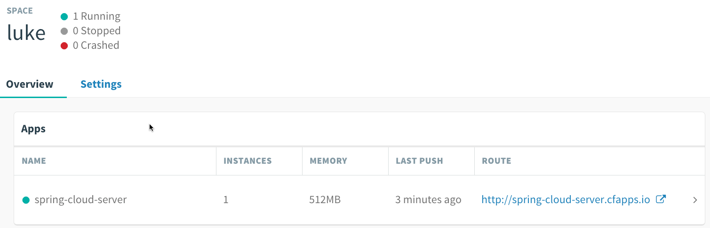
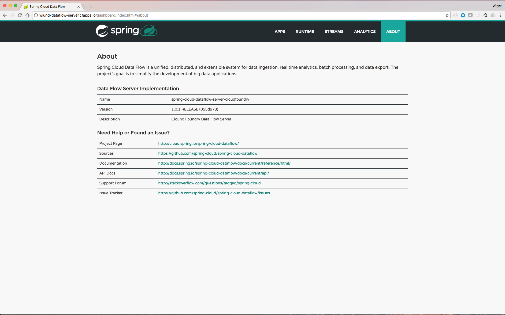
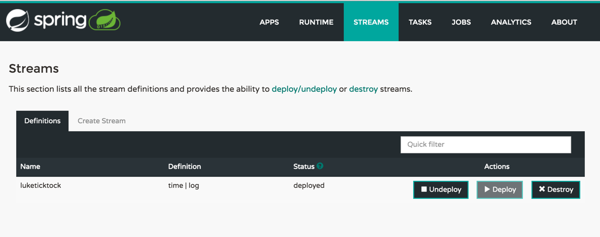
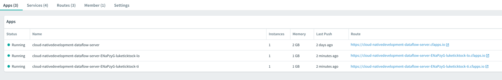
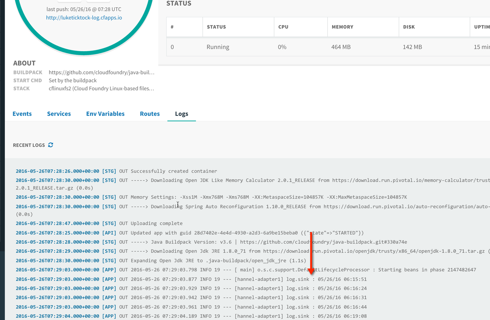
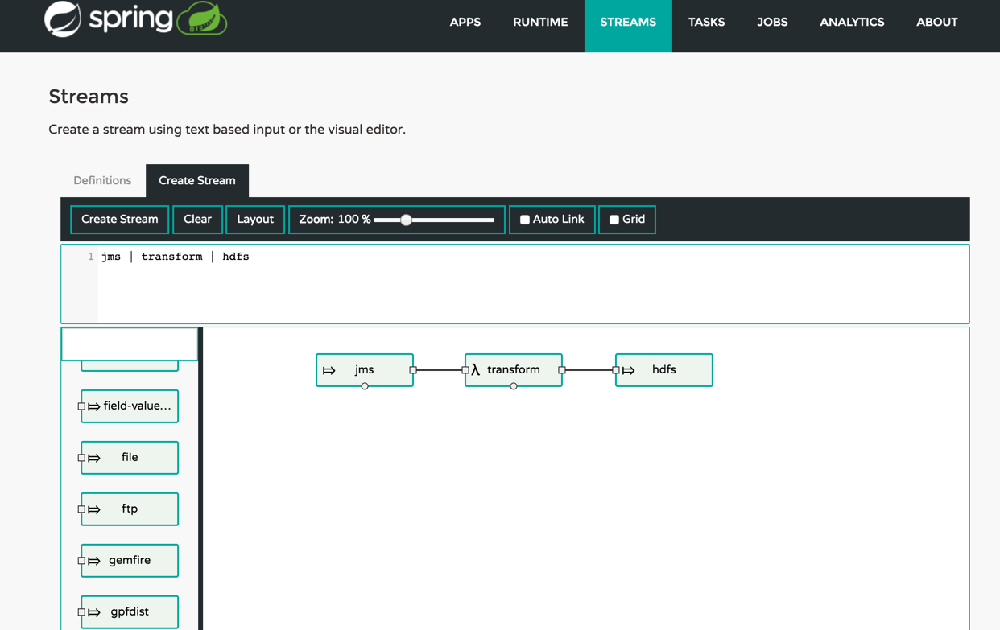

# Spring Cloud Data Flow Set Up

This is a simple demo to help you get up and running using Spring Cloud Data Flow (SCDF) on Pivotal Web Services (PWS). In this repo you will find:

1. Steps to get a SCDF Server running in PWS
2. Set Up the SCDF Shell locally
3. Get a 'Hello World' equivilant going for SCDF

## Setting Up The SCDF Server

The following steps need to be completed to get the server set up to submit Spring Cloud Data Flow streams.

1. Download the SCDF project
2. Download the Spring Cloud Shell project
3. Create a Redis Service in PCF
4. Create a Rabbit Service in PCF
5. Push the Server project into PCF (stopped)
6. Set up environmental variables for the Server to integrate with the elastic runtime of PCF
7. Start the Server

Running pws-scdf-setup.sh will perform all the steps on PWS (run.pivotal.io). The script will prompt for the organization, space, username and password as arguements.

It will create a server based on the name of our Org and Space. Then it will run on the necessary commands to set everything up

```shell

./pws-scdf-setup.sh

...

The Data Server will be called: cloud-nativedevelopment-dataflow-server 
Redis Serivce: cloud-nativedevelopment-scdf-redis
Rabbit Service: cloud-nativedevelopment-scdf-rabbit
MySQL: cloud-nativedevelopment-scdf-mysql

The following commands will be ran to set up your Server:
cf create-service rediscloud 30mb cloud-nativedevelopment-scdf-redis
cf create-service cloudamqp lemur cloud-nativedevelopment-scdf-rabbit
cf create-service cleardb spark cloud-nativedevelopment-scdf-mysql
(If you don't have it already) wget http://repo.spring.io/libs-release/org/springframework/cloud/spring-cloud-dataflow-server-cloudfoundry/1.2.4.RELEASE/spring-cloud-dataflow-server-cloudfoundry-1.2.4.RELEASE.jar
(If you don't have it already) wget http://repo.spring.io/release/org/springframework/cloud/spring-cloud-dataflow-shell/1.2.3.RELEASE/spring-cloud-dataflow-shell-1.2.3.RELEASE.jar
cf push cloud-nativedevelopment-dataflow-server --no-start -p server/spring-cloud-dataflow-server-cloudfoundry-1.2.4.RELEASE.jar
cf bind-service cloud-nativedevelopment-dataflow-server cloud-nativedevelopment-scdf-redis
cf bind-service cloud-nativedevelopment-dataflow-server cloud-nativedevelopment-scdf-rabbit
cf bind-service cloud-nativedevelopment-dataflow-server cloud-nativedevelopment-scdf-mysql
cf set-env cloud-nativedevelopment-dataflow-server MAVEN_REMOTE_REPOSITORIES_REPO1_URL https://repo.spring.io/libs-snapshot
cf set-env cloud-nativedevelopment-dataflow-server SPRING_CLOUD_DEPLOYER_CLOUDFOUNDRY_URL https://api.run.pivotal.io
cf set-env cloud-nativedevelopment-dataflow-server SPRING_CLOUD_DEPLOYER_CLOUDFOUNDRY_DOMAIN cfapps.io
cf set-env cloud-nativedevelopment-dataflow-server SPRING_CLOUD_DEPLOYER_CLOUDFOUNDRY_STREAM_SERVICES cloud-nativedevelopment-scdf-rabbit
cf set-env cloud-nativedevelopment-dataflow-server SPRING_CLOUD_DEPLOYER_CLOUDFOUNDRY_SKIP_SSL_VALIDATION false
cf set-env cloud-nativedevelopment-dataflow-server SPRING_CLOUD_DEPLOYER_CLOUDFOUNDRY_SERVICES cloud-nativedevelopment-scdf-redis,cloud-nativedevelopment-scdf-rabbit
Setting Env for Username and Password silently
cf set-env cloud-nativedevelopment-dataflow-server SPRING_CLOUD_DEPLOYER_CLOUDFOUNDRY_USERNAME ********* > /dev/null
cf set-env cloud-nativedevelopment-dataflow-server SPRING_CLOUD_DEPLOYER_CLOUDFOUNDRY_PASSWORD ********* > /dev/null
cf set-env cloud-nativedevelopment-dataflow-server SPRING_CLOUD_DEPLOYER_CLOUDFOUNDRY_ORG cloud-native
cf set-env cloud-nativedevelopment-dataflow-server SPRING_CLOUD_DEPLOYER_CLOUDFOUNDRY_SPACE development

Do you wish to run these commands (there will be a charge for all these services in PWS)? (Type 'Y' to proceed)

....

NOTE: You will need a paid account to run this (25 GB of available application memory). **Do not leave this running**. Use the clean up script to delete the Server and its servers.

```
Upon successful completetion of the script, a Spring Cloud Data Flow server will be running on PWS.



The dashboard will provide information about the Streams running and other useful details about the state of the Spring Cloud Data Flow Server (http://luke-dataflow-server.cfapps.io/dashboard)



### Connecting To The Running Server

Next step is too connect a locally running Spring Cloud Shell to the running server to create the famous TickTock stream. To do this start the Shell application locally and use the `dataflow config server` command to connect to the server.

```shell

➜  spring-cloud-data-flow-setup git:(master) java -jar shell/spring-cloud-dataflow-shell-1.2.3.RELEASE.jar  
  ____                              ____ _                __
 / ___| _ __  _ __(_)_ __   __ _   / ___| | ___  _   _  __| |
 \___ \| '_ \| '__| | '_ \ / _` | | |   | |/ _ \| | | |/ _` |
  ___) | |_) | |  | | | | | (_| | | |___| | (_) | |_| | (_| |
 |____/| .__/|_|  |_|_| |_|\__, |  \____|_|\___/ \__,_|\__,_|
  ____ |_|    _          __|___/                 __________
 |  _ \  __ _| |_ __ _  |  ___| | _____      __  \ \ \ \ \ \
 | | | |/ _` | __/ _` | | |_  | |/ _ \ \ /\ / /   \ \ \ \ \ \
 | |_| | (_| | || (_| | |  _| | | (_) \ V  V /    / / / / / /
 |____/ \__,_|\__\__,_| |_|   |_|\___/ \_/\_/    /_/_/_/_/_/

1.2.3.RELEASE

Welcome to the Spring Cloud Data Flow shell. For assistance hit TAB or type "help".
server-unknown:>

```

Next we perform the following steps:

1. Register maven repos
2. Register the sources
3. Register the sinks
4. Register the processors
5. Create a simple test stream

The command to register maven is:
- cf set-env luke-dataflow-server MAVEN_REMOTE_REPOSITORIES_REPO1_URL https://repo.spring.io/libs-snapshot

The commands to registers the sources, sinks and processors handled by Spring Cloud Dataflow App Starters. Simply execute the command
from dataflow:

```shell
dataflow> app import http://bit.ly/Bacon-RELEASE-stream-applications-rabbit-maven 
Successfully registered applications: [sink.task-launcher-yarn, source.tcp, sink.jdbc, source.http, sink.rabbit, source.rabbit, source.ftp, sink.gpfdist, processor.transform, source.loggregator, source.sftp, processor.filter, source.file, sink.cassandra, processor.groovy-filter, sink.router, source.trigger, sink.hdfs-dataset, processor.splitter, source.load-generator, sink.sftp, sink.file, processor.tcp-client, source.time, source.gemfire, source.twitterstream, sink.tcp, source.jdbc, sink.field-value-counter, sink.redis-pubsub, sink.hdfs, sink.task-launcher-local, processor.bridge, processor.pmml, processor.httpclient, sink.ftp, source.s3, sink.log, sink.gemfire, sink.aggregate-counter, sink.throughput, source.triggertask, sink.s3, source.gemfire-cq, source.jms, source.tcp-client, processor.scriptable-transform, sink.counter, sink.websocket, source.mongodb, source.mail, processor.groovy-transform, source.syslog]
```
To see the apps

```shell
dataflow:>app  list
╔══════════════╤════════════════╤═══════════════════╤════╗
║    source    │   processor    │       sink        │task║
╠══════════════╪════════════════╪═══════════════════╪════╣
║file          │bridge          │aggregate-counter  │    ║
║ftp           │filter          │cassandra          │    ║
║http          │groovy-filter   │counter            │    ║
║jdbc          │groovy-transform│field-value-counter│    ║
║jms           │httpclient      │file               │    ║
║load-generator│pmml            │ftp                │    ║
║rabbit        │splitter        │gemfire            │    ║
║sftp          │transform       │gpfdist            │    ║
║tcp           │                │hdfs               │    ║
║time          │                │jdbc               │    ║
║              │                │log                │    ║
╚══════════════╧════════════════╧═══════════════════╧════╝

```

To list the streams (none have been defined yet in this example)

```shell
dataflow:>stream list
╔═══════════╤═════════════════╤══════╗
║Stream Name│Stream Definition│Status║
╚═══════════╧═════════════════╧══════╝

dataflow:>
```
Our 'Hello World' will be the infamous 'ticktock' stream. It has two components. One that writes out the time another that writes that time to the log file. RabbitMQ is used to pass the time value as a message to the logging componet.

To create the stream, run the following:

```shell

dataflow:>stream create luketicktock --definition "time | log" --deploy
Created and deployed new stream 'ticktock'
dataflow:>

```
The stream can now be seen in the UI:



In the apps console we can see a Micro Service (Spring Boot) for each task in the stream has been deployed and given a route. They are also bound to the Rabbit and Redis services.



We can now see the result of the stream showing up in the Micro Service for the logging step of the flow



New streams can be created using the dashboard.



Only the sources and sinks that are registered with the server will show up in the palette. Custom apps can be registered.

# References

http://cloud.spring.io/spring-cloud-dataflow/

https://github.com/spring-projects/spring-integration-java-dsl/wiki/spring-integration-java-dsl-reference
