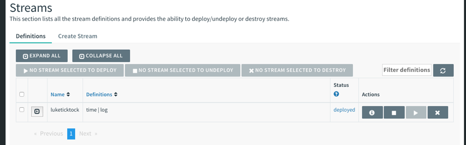
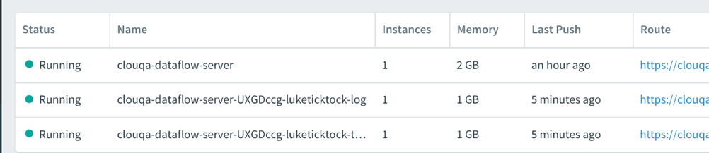

# Introduction

Spring Cloud Data Flow (SCDF) provides a framework for creating, operating and monitoring data event streams:

https://cloud.spring.io/spring-cloud-dataflow/

To take advantage of this framework, a SCDF Admin server needs to be running (and integrated) with a supported platform. In the case of this sample, that runtime is PCF.

This is a quick sample to get the Spring Cloud Dataflow (SCDF) Admin Application running on PCF. There is scripts for PWS (version of PCF running on AWS managed by Pivotal) and for PCF running on one of it's supported platforms (Azure/GCP/AWS/vSphere/Open Stack). The difference with these scripts is the PWS script sets up the required services as well installs the Admin. For the generic PCF script, the required services need to be created prior to running the script. The better option for these users is the following tile. It sets up everything required and is kept in sync with the SCDF roadmap:

http://docs.pivotal.io/scdf/

For more information on running SCDF on PCF:

https://docs.spring.io/spring-cloud-dataflow-server-cloudfoundry/docs/1.3.0.RELEASE/reference/htmlsingle/#getting-started

## Setting Up The SCDF Server

The SCDF Server gets stream definitions submitted to it, its uses the platform its running in to then generate and deploy Spring Boot applications (into the same platform it's running in) to perform the steps in the stream. For example, read files from message queue, transform them, and then write them into HDFS.

The scripts in this project execute the following steps to get the Admin server running on PCF.

1. Download the SCDF Admin project
2. Download the Spring Cloud Shell project (used to submit streams from a local machine to the server)
3. Create a Redis Service in PCF
4. Create a Rabbit Service in PCF
5. Push the Server project into PCF (stopped)
6. Set up environmental variables for the Server to integrate with the elastic runtime of PCF and Redis + Rabbit
7. Start the Server

### Setting Up On PWS

Running setup-pws.sh will perform all the steps on PWS (run.pivotal.io). The script will prompt for the organization, space, username and password as arguments. These are required for the admin server to be able to create and manage data streams.

The script will create an Admin Service instance based on a trimmed version the names of the Org and Space.

A preview of these commands to be ran to set up the Admin is previewed at the start of the script. This provides a chance to cancel if a mistake was made, or if doing something cool is too scary for you.

```shell

./setup-pws.sh

...

The Data Server will be called: cloud-nativedevelopment-dataflow-server
Redis Serivce: cloud-nativedevelopment-scdf-redis
Rabbit Service: cloud-nativedevelopment-scdf-rabbit
MySQL: cloud-nativedevelopment-scdf-mysql

The following commands will be ran to set up your Server:
cf create-service rediscloud 30mb cloud-nativedevelopment-scdf-redis
cf create-service cloudamqp lemur cloud-nativedevelopment-scdf-rabbit
cf create-service cleardb spark cloud-nativedevelopment-scdf-mysql
(If you don't have it already) wget http://repo.spring.io/libs-release/org/springframework/cloud/spring-cloud-dataflow-server-cloudfoundry/1.2.4.RELEASE/spring-cloud-dataflow-server-cloudfoundry-1.2.4.RELEASE.jar
(If you don't have it already) wget http://repo.spring.io/release/org/springframework/cloud/spring-cloud-dataflow-shell/1.2.3.RELEASE/spring-cloud-dataflow-shell-1.2.3.RELEASE.jar
cf push cloud-nativedevelopment-dataflow-server --no-start -p server/spring-cloud-dataflow-server-cloudfoundry-1.2.4.RELEASE.jar
cf bind-service cloud-nativedevelopment-dataflow-server cloud-nativedevelopment-scdf-redis
cf bind-service cloud-nativedevelopment-dataflow-server cloud-nativedevelopment-scdf-rabbit
cf bind-service cloud-nativedevelopment-dataflow-server cloud-nativedevelopment-scdf-mysql
cf set-env cloud-nativedevelopment-dataflow-server MAVEN_REMOTE_REPOSITORIES_REPO1_URL https://repo.spring.io/libs-snapshot
cf set-env cloud-nativedevelopment-dataflow-server SPRING_CLOUD_DEPLOYER_CLOUDFOUNDRY_URL https://api.run.pivotal.io
cf set-env cloud-nativedevelopment-dataflow-server SPRING_CLOUD_DEPLOYER_CLOUDFOUNDRY_DOMAIN cfapps.io
cf set-env cloud-nativedevelopment-dataflow-server SPRING_CLOUD_DEPLOYER_CLOUDFOUNDRY_STREAM_SERVICES cloud-nativedevelopment-scdf-rabbit
cf set-env cloud-nativedevelopment-dataflow-server SPRING_CLOUD_DEPLOYER_CLOUDFOUNDRY_SKIP_SSL_VALIDATION false
cf set-env cloud-nativedevelopment-dataflow-server SPRING_CLOUD_DEPLOYER_CLOUDFOUNDRY_SERVICES cloud-nativedevelopment-scdf-redis,cloud-nativedevelopment-scdf-rabbit
Setting Env for Username and Password silently
cf set-env cloud-nativedevelopment-dataflow-server SPRING_CLOUD_DEPLOYER_CLOUDFOUNDRY_USERNAME ********* > /dev/null
cf set-env cloud-nativedevelopment-dataflow-server SPRING_CLOUD_DEPLOYER_CLOUDFOUNDRY_PASSWORD ********* > /dev/null
cf set-env cloud-nativedevelopment-dataflow-server SPRING_CLOUD_DEPLOYER_CLOUDFOUNDRY_ORG cloud-native
cf set-env cloud-nativedevelopment-dataflow-server SPRING_CLOUD_DEPLOYER_CLOUDFOUNDRY_SPACE development

Do you wish to run these commands (there will be a charge for all these services in PWS)? (Type 'Y' to proceed)

....rest of script output omitted for brevity...it just does the commands above

```

NOTE: **Do not leave this SDCF Streams running in PWS unless their are serving a business purpose**. As PWS bills based on usage, a running stream can run up a serious bill. If you are doing this for learning, use the clean up script to delete the Server and its services once you are done with your stream.

Upon successful completion of the script, a Spring Cloud Data Flow server will be running on PWS.


The dashboard will provide information about the Streams running and other useful details about the state of the Spring Cloud Data Flow Server (http://luke-dataflow-server.cfapps.io/dashboard)


### Connecting To The Running Server

Next step is too connect a locally running Spring Cloud Shell to the running server to create the famous TickTock stream. To do this start the Shell application locally and use the `dataflow config server` command to connect to the server.

```shell

➜  spring-cloud-data-flow-setup git:(master) java -jar shell/spring-cloud-dataflow-shell-1.3.1.RELEASE.jar
  ____                              ____ _                __
 / ___| _ __  _ __(_)_ __   __ _   / ___| | ___  _   _  __| |
 \___ \| '_ \| '__| | '_ \ / _` | | |   | |/ _ \| | | |/ _` |
  ___) | |_) | |  | | | | | (_| | | |___| | (_) | |_| | (_| |
 |____/| .__/|_|  |_|_| |_|\__, |  \____|_|\___/ \__,_|\__,_|
  ____ |_|    _          __|___/                 __________
 |  _ \  __ _| |_ __ _  |  ___| | _____      __  \ \ \ \ \ \
 | | | |/ _` | __/ _` | | |_  | |/ _ \ \ /\ / /   \ \ \ \ \ \
 | |_| | (_| | || (_| | |  _| | | (_) \ V  V /    / / / / / /
 |____/ \__,_|\__\__,_| |_|   |_|\___/ \_/\_/    /_/_/_/_/_/

1.3.1.RELEASE

Welcome to the Spring Cloud Data Flow shell. For assistance hit TAB or type "help".
server-unknown:>


```
Now we can connect to the Server

```shell

server-unknown:>dataflow config server https://clouqa-dataflow-server.cfapps.io
Shell mode: classic, Server mode: classic
dataflow:>

```
Your server name will not the same as mine (its based on the Org and Space).

Next we will import the sources, sinks and processors handled by Spring Cloud Dataflow App Starters. Execute the command
from dataflow:

```shell
app import --uri http://bit.ly/Celsius-SR1-stream-applications-rabbit-maven
Successfully registered 65 applications from [source.sftp, source.mqtt.metadata, sink.mqtt.metadata, source.file.metadata, processor.tcp-client, source.s3.metadata, source.jms, source.ftp, processor.transform.metadata, source.time, sink.mqtt, sink.s3.metadata, processor.scriptable-transform, sink.log, source.load-generator, processor.transform, source.syslog, sink.websocket.metadata, sink.task-launcher-local.metadata, source.loggregator.metadata, source.s3, source.load-generator.metadata, processor.pmml.metadata, source.loggregator, source.tcp.metadata, processor.httpclient.metadata, sink.file.metadata, source.triggertask, source.twitterstream, source.gemfire-cq.metadata, processor.aggregator.metadata, source.mongodb, source.time.metadata, source.gemfire-cq, sink.counter.metadata, source.http, sink.tcp.metadata, sink.pgcopy.metadata, source.rabbit, sink.task-launcher-yarn, source.jms.metadata, sink.gemfire.metadata, sink.cassandra.metadata, processor.tcp-client.metadata, processor.header-enricher, sink.throughput, sink.task-launcher-local, processor.python-http, sink.aggregate-counter.metadata, sink.mongodb, processor.twitter-sentiment, sink.log.metadata, processor.splitter, sink.hdfs-dataset, source.tcp, processor.python-jython.metadata, source.trigger, source.mongodb.metadata, processor.bridge, source.http.metadata, source.rabbit.metadata, sink.ftp, sink.jdbc, source.jdbc.metadata, source.mqtt, processor.pmml, sink.aggregate-counter, sink.rabbit.metadata, processor.python-jython, sink.router.metadata, sink.cassandra, processor.filter.metadata, source.tcp-client.metadata, processor.header-enricher.metadata, processor.groovy-transform, source.ftp.metadata, sink.router, sink.redis-pubsub, source.tcp-client, processor.httpclient, sink.file, sink.websocket, source.syslog.metadata, sink.s3, sink.counter, sink.rabbit, processor.filter, source.trigger.metadata, source.mail.metadata, sink.gpfdist.metadata, sink.pgcopy, processor.python-http.metadata, sink.jdbc.metadata, sink.gpfdist, sink.ftp.metadata, processor.splitter.metadata, sink.sftp, sink.field-value-counter, processor.groovy-filter.metadata, processor.twitter-sentiment.metadata, source.triggertask.metadata, sink.hdfs, processor.groovy-filter, sink.redis-pubsub.metadata, source.sftp.metadata, processor.bridge.metadata, sink.field-value-counter.metadata, processor.groovy-transform.metadata, processor.aggregator, sink.sftp.metadata, processor.tensorflow.metadata, sink.throughput.metadata, sink.hdfs-dataset.metadata, sink.tcp, source.mail, sink.task-launcher-cloudfoundry.metadata, source.gemfire.metadata, processor.tensorflow, source.jdbc, sink.task-launcher-yarn.metadata, sink.gemfire, source.gemfire, source.twitterstream.metadata, sink.hdfs.metadata, processor.tasklaunchrequest-transform, sink.task-launcher-cloudfoundry, source.file, sink.mongodb.metadata, processor.tasklaunchrequest-transform.metadata, processor.scriptable-transform.metadata]

```
To learn more about the Starters, check out the following:
https://cloud.spring.io/spring-cloud-stream-app-starters/

To see the components that have been registered.

```shell

dataflow:>app list
╔══════════════╤═══════════════════════════╤══════════════════════════╤════╗
║    source    │         processor         │           sink           │task║
╠══════════════╪═══════════════════════════╪══════════════════════════╪════╣
║file          │aggregator                 │aggregate-counter         │    ║
║ftp           │bridge                     │cassandra                 │    ║
║gemfire       │filter                     │counter                   │    ║
║gemfire-cq    │groovy-filter              │field-value-counter       │    ║
║http          │groovy-transform           │file                      │    ║
║jdbc          │header-enricher            │ftp                       │    ║
║jms           │httpclient                 │gemfire                   │    ║
║load-generator│pmml                       │gpfdist                   │    ║
║loggregator   │python-http                │hdfs                      │    ║
║mail          │python-jython              │hdfs-dataset              │    ║
║mongodb       │scriptable-transform       │jdbc                      │    ║
║mqtt          │splitter                   │log                       │    ║
║rabbit        │tasklaunchrequest-transform│mongodb                   │    ║
║s3            │tcp-client                 │mqtt                      │    ║
║sftp          │tensorflow                 │pgcopy                    │    ║
║syslog        │transform                  │rabbit                    │    ║
║tcp           │twitter-sentiment          │redis-pubsub              │    ║
║tcp-client    │                           │router                    │    ║
║time          │                           │s3                        │    ║
║trigger       │                           │sftp                      │    ║
║triggertask   │                           │task-launcher-cloudfoundry│    ║
║twitterstream │                           │task-launcher-local       │    ║
║              │                           │task-launcher-yarn        │    ║
║              │                           │tcp                       │    ║
║              │                           │throughput                │    ║
║              │                           │websocket                 │    ║
╚══════════════╧═══════════════════════════╧══════════════════════════╧════╝

```
As you can see, lots of great components here.

To list the streams (none have been defined yet in this example)

```shell
dataflow:>stream list

╔═══════════╤═════════════════╤══════╗
║Stream Name│Stream Definition│Status║
╚═══════════╧═════════════════╧══════╝

dataflow:>
```
Our 'Hello World' will be the infamous 'ticktock' stream. It has two components. One that writes out the time another that writes that time to the log file. RabbitMQ is used to pass the time value as a message to the logging componet.

To create the stream, run the following:

```shell

dataflow:>stream create luketicktock --definition "time | log" --deploy
Created new stream 'luketicktock'
Deployment request has been sent
dataflow:>

```
The stream can now be seen in the UI:



In the apps console of PCF we can see a Micro Service (Spring Boot) for each task in the stream has been deployed and given a route. They are also bound to the Rabbit Service as their backing data store.



We can now see the result of the stream showing up in the Micro Service for the logging step of the flow


New streams can be created using the dashboard, if you are not a fan of the Shell.


Only the sources and sinks that are registered with the server will show up in the palette. Custom apps can be registered.

## Next Steps

This gets you started. Stay tuned for a more interesting example using this set up.

# References

http://cloud.spring.io/spring-cloud-dataflow/

https://github.com/spring-projects/spring-integration-java-dsl/wiki/spring-integration-java-dsl-reference
